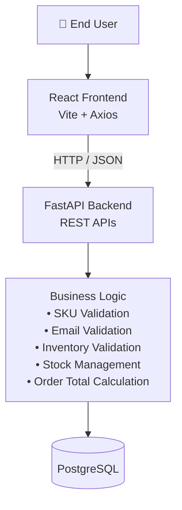
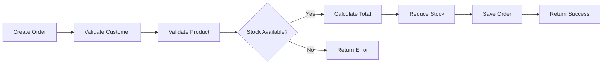
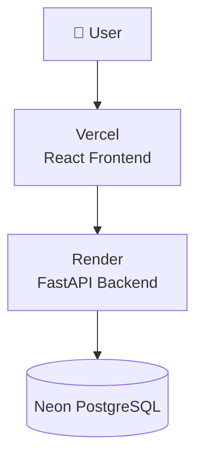
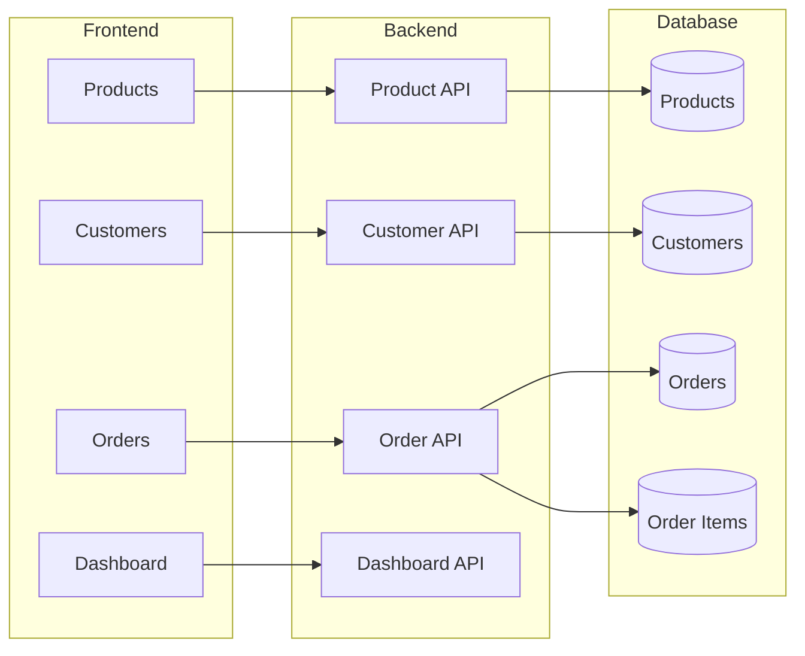
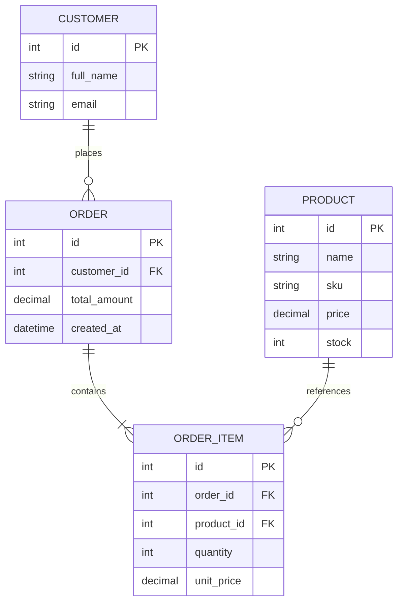

# Inventory & Order Management System

## Overview

The Inventory & Order Management System is a full-stack web application designed to help businesses efficiently manage products, customers, inventory, and orders. The application provides a simple and intuitive interface for maintaining product catalogs, tracking customer information, and processing orders while automatically managing inventory levels.

The backend exposes a RESTful API built with FastAPI, the frontend is developed using React, and all application data is stored in PostgreSQL. The entire application is containerized using Docker and orchestrated with Docker Compose, enabling consistent local development and easy deployment.

---

## High-Level Architecture

---

# System Components

### Frontend (React)

The frontend provides a responsive user interface that enables users to:

- Manage products
- Manage customers
- Create and track orders
- View inventory status
- Monitor dashboard statistics

---

### Backend (FastAPI)

The backend exposes REST APIs responsible for:

- CRUD operations for products
- CRUD operations for customers
- Order creation and management
- Inventory validation
- Automatic stock updates
- Order total calculation
- Request validation and error handling

---

### Database (PostgreSQL)

The PostgreSQL database stores all persistent application data including:

- Products
- Customers
- Orders
- Order Items

The database enforces unique constraints such as Product SKU and Customer Email.

---

## Business Workflow

---

## Deployment Architecture

---

## Component Architecture

## Database Schema

# Technology Stack

| Layer | Technology |
|--------|------------|
| Frontend | React + Vite |
| Backend | FastAPI |
| Database | PostgreSQL |
| ORM | SQLAlchemy |
| API Validation | Pydantic |
| Containerization | Docker |
| Orchestration | Docker Compose |
| Version Control | Git |
| Backend Deployment | Render |
| Frontend Deployment | Vercel |
| Database Hosting | Neon PostgreSQL |
